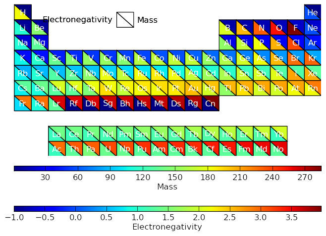
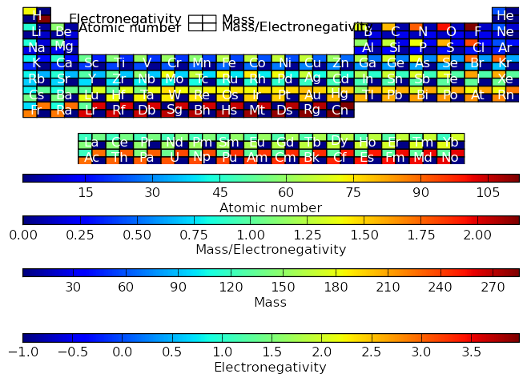
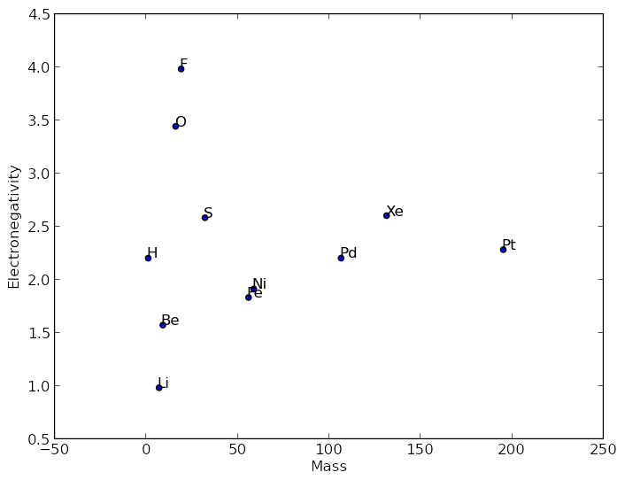

periodic-table-plotter
======================

Make a periodic table that plots 1-4 values per tile, easily configure grids 
of pair-wise elemental data (with 1-4 values per tile) and create 
pettifor-style trend plots.

Periodic table with one value per tile

```python
def eneg(elt):
    """Electronegativity"""
    return elt['electronegativity']

epd = ElementDataPlotter()
epd.ptable([eneg])
plt.show()
```


Periodic table with two values per tile
```python
def mass(elt):
    """Mass"""
    return elt['mass']

epd = ElementDataPlotter()
epd.ptable([eneg, mass])
plt.show()
```


Periodic table with three values per tile
```python
def rat(elt):
    """Mass/Electronegativity"""
    return elt['electronegativity']/elt['mass']

epd = ElementDataPlotter()
epd.ptable([eneg, mass, rat])
plt.show()
```


Periodic table with four values per tile
```python
def atomic_number(elt):
    """Atomic number"""
    return elt['z']

epd = ElementDataPlotter()
epd.ptable([eneg, mass, rat, atomic_number])
plt.show()
```


Pettifor style map:
```python
elts = ['H', 'Li', 'Be', 'Fe', 'Ni', 'Pd', 'Pt', 'F', 'Xe', 'O', 'S']
epd = ElementDataPlotter(elements=elts)
epd.pettifor(mass, eneg)
plt.savefig('pettifor.png', bbox_inches='tight')
plt.show()
```


Grid of pair-wise elemental data:
```python
elts = [ 'Ti', 'V', 'Sc', 'Ni', 'Co', 'Fe' ]
epd = ElementDataPlotter()
epd.make_grid(xelts=elts, yelts=elts)
plt.show()
```

